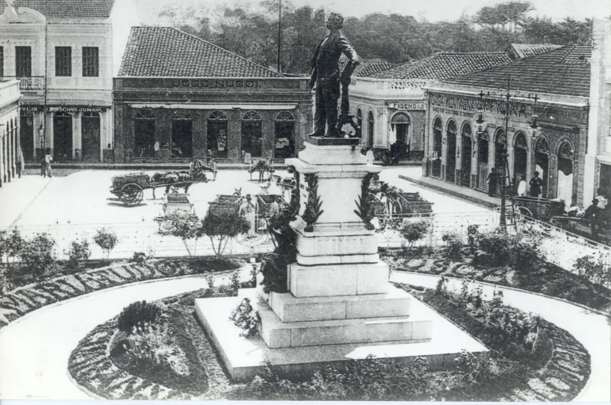
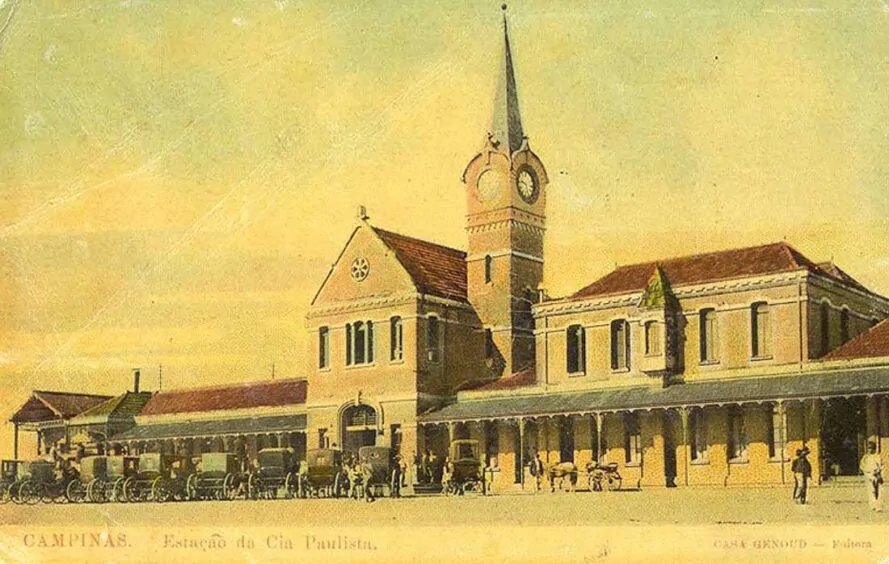
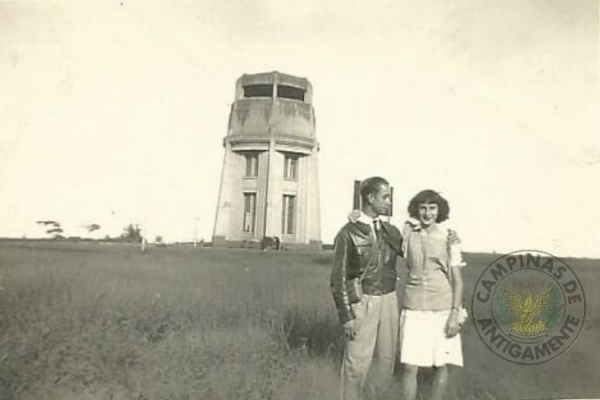
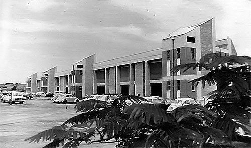
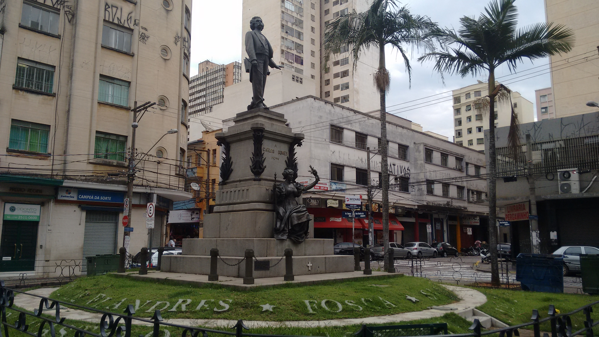
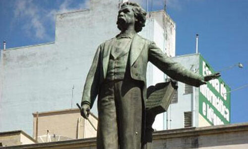
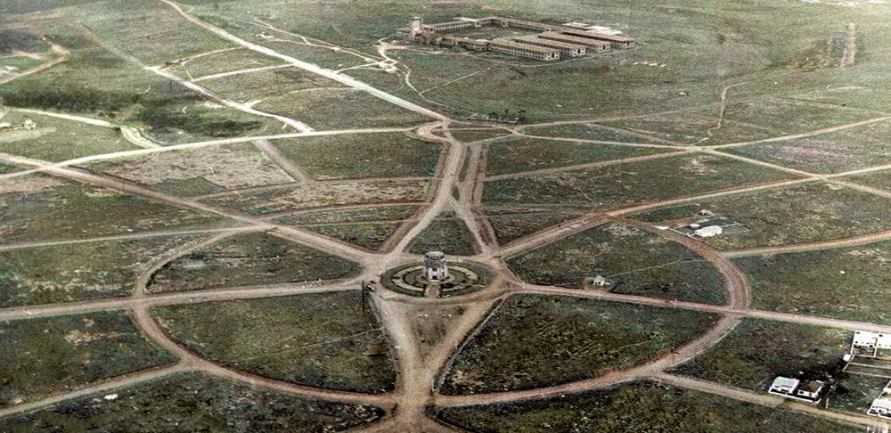
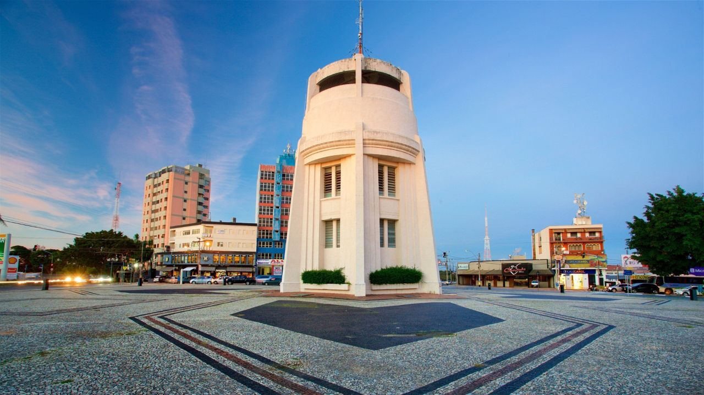
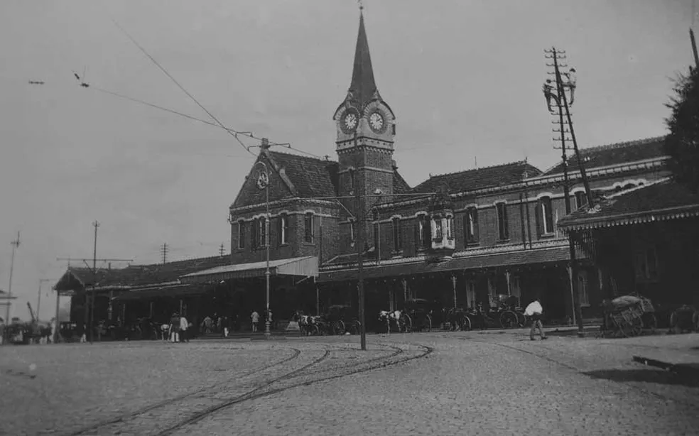
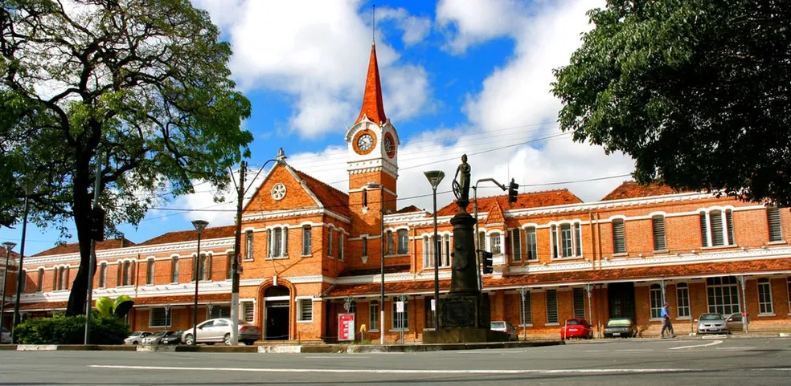

<!DOCTYPE html>
<html lang="pt-br">
<head>

<meta charset="UTF-8">
<meta name="viewport" content="width=device-width, initial-scale=1">

<title>Preservação da Memória Local de Campinas</title>

<!-- Bootstrap -->
<link href="https://cdn.jsdelivr.net/npm/bootstrap@5.3.2/dist/css/bootstrap.min.css" rel="stylesheet">

<!-- Google Font -->
<link href="https://fonts.googleapis.com/css2?family=Poppins:wght@300;400;600&display=swap" rel="stylesheet">

<!-- CSS -->
<link rel="stylesheet" href="style.css">

</head>

<body>

<!-- NAVBAR -->

<nav class="navbar navbar-expand-lg navbar-white bg-white fixed-top">

<a class="navbar-brand d-flex align-items-center" href="#">

Memória Local de Campinas
</a>

<button class="navbar-toggler" type="button" data-bs-toggle="collapse" data-bs-target="#menu">

</button>

<ul class="navbar-nav ms-auto">

<li class="nav-item">
<a class="nav-link" href="#sobre">Memória Local</a>
</li>

<li class="nav-item">
<a class="nav-link" href="#patrimonios">Patrimônios Culturais de Campinas</a>
</li>

<li class="nav-item">
<a class="nav-link" href="#ONG">ONGs</a>
</li>

</ul>

</nav>

<!-- HERO -->

<section class="hero">

<h1>Preservação da Memória Local</h1>

A memória local de Campinas é preservada por diversas instituições e projetos que focam no patrimônio histórico, audiovisual e cultural da cidade

<a href="#sobre" class="btn btn-light btn-lg">Saiba mais</a>

</section>

<!-- SOBRE -->

<section id="sobre" class="section container">

<h2 class="text-center mb-4">O que é a Memória Local</h2>

A memória local é o conjunto de histórias, tradições, patrimônios e acontecimentos que marcaram uma cidade ao longo do tempo. 
Preservar essa memória é importante para manter viva a identidade cultural da população e valorizar a história de Campinas.

</section>

<!-- Linha do Tempo de Campinas -->

<section class="section bg-light">

<h2 class="text-center mb-5">Linha do Tempo de Campinas</h2>

<h5>1774</h5>

Fundação de Campinas, que começou como um pequeno povoado no interior de São Paulo.

<h5>1884</h5>

Inauguração da Estação Cultura, importante para o desenvolvimento da cidade.

<h5>1936 – 1940</h5>

Construção da Torre do Castelo, que originalmente funcionava como reservatório de água.

<h5>1982</h5>

Fundação da Unicamp transformou Campinas em um dos maiores centros de ciência e tecnologia do Brasil.

</section>

<!-- Patrimônios Culturais de Campinas -->

<section id="patrimonios" class="section bg-light">

<h2 class="text-center mb-5">Patrimônios Culturais de Campinas</h2>

<h5 class="card-title">Monumento-Túmulo Carlos Gomes</h5>

Carlos Gomes nasceu em Campinas, em 11 de julho de 1836. Morreu em Belém do Pará, em 16 de setembro de 1896
O Monumento-túmulo está localizado na mesma praça onde encontram-se o marco zero da cidade.

<h5 class="card-title">Torre do Castelo</h5>

A Torre do Castelo, localizada na Praça 23 de Outubro, no bairro Jardim Chapadão, em Campinas, é um dos principais marcos arquitetônicos e históricos da cidade. Construída entre 1936 e 1940, o edifício é um exemplar notável do estilo art déco

<h5 class="card-title">Estação Cultura</h5>

A Estação Cultura de Campinas, inaugurada em 1884 no estilo gótico vitoriano com tijolos ingleses, foi o coração ferroviário da Companhia Paulista, crucial para o ciclo do café. Tombada em 1982, funcionou como estação de passageiros até 2001

</section>

<!-- Mapa do Local -->
<iframe
    src="https://www.google.com/maps?q=Unicamp%20Campinas&output=embed"
    width="100%"
    height="300"
    style="border:0;"
    loading="lazy">
</iframe>

<!-- Curiosidades sobre Campinas -->

<section class="section container">

<h2 class="text-center mb-4">Curiosidades sobre Campinas</h2>

<ul class="list-group">

<li class="list-group-item">Campinas foi um dos maiores centros produtores de café do Brasil no século XIX.</li>

<li class="list-group-item">A cidade é conhecida como "Princesa D'Oeste".</li>

<li class="list-group-item">A Torre do Castelo era originalmente um reservatório de água.</li>

<li class="list-group-item">Campinas é uma das cidades mais importantes do interior paulista.</li>

</ul>

</section>

<!-- ONG -->

<section id="ONG" class="section bg-light">

<h2 class="text-center mb-4">Instituições que preservam a memória</h2>

<ul class="list-group">

<li class="list-group-item">
Centro de Memória da Unicamp
</li>

<li class="list-group-item">
Museu da Imagem e do Som de Campinas
</li>

<li class="list-group-item">
CONDEPACC (Conselho de Patrimônio Histórico)
</li>

</ul>

</section>

<!-- Relações Com Física -->

<section class="section container">

<h2 class="text-center mb-4">Relações Com Física</h2>

Preservar a memória local é fundamental para manter viva a história e a identidade cultural de uma cidade. 
Os patrimônios históricos de Campinas ajudam a contar como a cidade se desenvolveu ao longo do tempo e 
permitem que as futuras gerações conheçam e valorizem sua própria história.

</section>

<footer>

Projeto Site ONG | 2026 
    

    Lucas Peres | Richard Pirelli

</footer>

</body>
</html>
